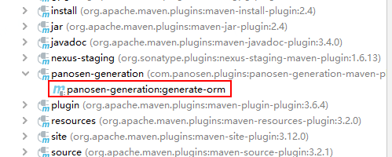

# panosen-generation-maven-plugin
Panosen Generation Maven Plugin


## usage

### step 1. add plugin to pom.xml
```
    <build>
        <plugins>
            <plugin>
                <groupId>com.panosen.plugins</groupId>
                <artifactId>panosen-generation-maven-plugin</artifactId>
                <version>0.2.1</version>
                <configuration>
                    <packageName>org.example</packageName>
                    <databases>
                        <database>
                            <name>library</name>
                            <url>jdbc:mysql://127.0.0.1:3306/library</url>
                            <username>root</username>
                            <password>harriszhang</password>
                        </database>
                    </databases>
                </configuration>
            </plugin>
        </plugins>
    </build>
```

### step 2. double click mojo in Plugins from ieaa panel.



### step 3. get your code.

## demo project

[https://github.com/panosen/panosen-generation-maven-plugin-sample](https://github.com/panosen/panosen-generation-maven-plugin-sample)